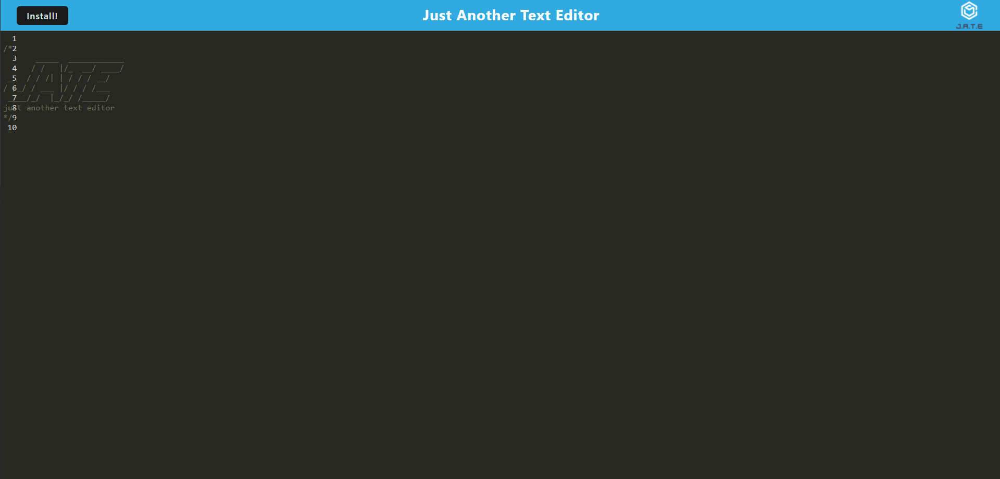

# Text Editor

The Text Editor Application is a user-friendly online tool that allows you to create, edit, and manage text documents with ease. This tool simplifies text document management and is useful for a wide range of writing and editing tasks.

## Usage

To access the Text Editor Web Application, visit [Text Editor](https://texteditor-cf-e14f301a1d69.herokuapp.com/).

Simply open the provided URL in your web browser to start using the text editor.

## Credits

Phil Loy

 
## License
This project is licensed under the MIT License.

© 2023 Christian Flores